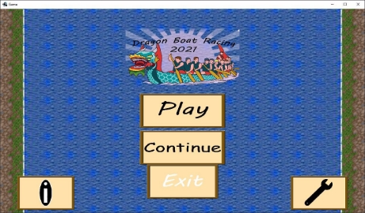
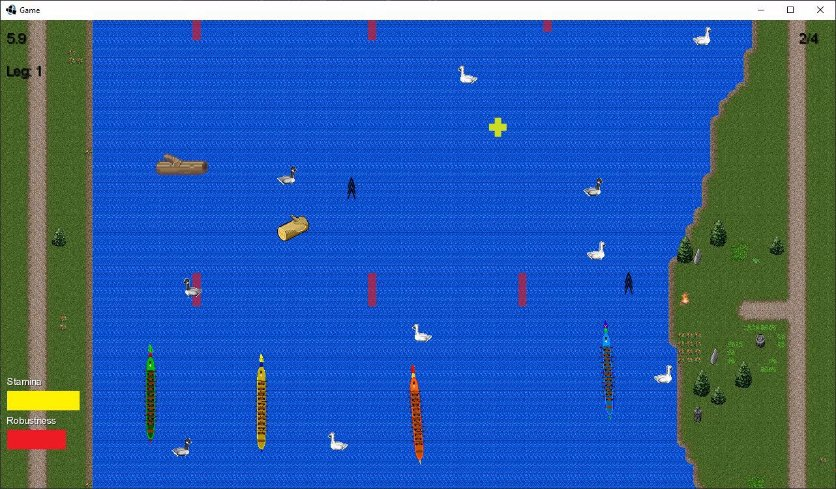

# Testing

[Deliverable (.pdf)](../assets/deliverables-new/Test2.pdf){: .btn .btn-primary .fs-5 .mb-4 .mb-md-0 .mr-2 }

{: .no_toc }

  

    Table of contents
  

  {: .text-delta }
1. TOC
{:toc}

---

Summary (a):

Our test plan is primarily driven by our requirements - tests were written to cover all of them, in addition to a handful of tests that are not explicitly linked to a requirement.

While not all aspects of the engine could be mocked, we were able to mock some parts to create a more consistent testing environment. All our test classes inherit from TestBase, which (in addition to providing some common testing functions), mocks the engine’s timer and temporarily clears the preferences file, to ensure the testing environment is as consistent as possible.

Our test classes are organised into two packages - UITests is a set of unit tests for the UI, which primarily covers pressing buttons and ensuring the correct changes to state are made. GameTests contains both unit and interface tests, and covers objects on the river.

Challenges

There were two major issues that restricted our ability to write automated tests:

The first problem was that it was not possible to use the engine’s rendering libraries in the testing environment, so rendering related functions couldn’t be tested. Some extensive refactoring would have enabled us to mock the libraries and run the functions, but our ability to write meaningful tests on the functions would have been limited, as mocking the libraries removes most of the functionality worth testing. We decided this was not worth pursuing with the time constraints.

For this reason, all tests for rendering related functions are done manually.

The second problem was that it was impossible to test the Game class, as it was too closely linked to the game engine and could not be instantiated without errors. The relevant parts of the engine could not be mocked to avoid this, as the Game class relies on complex behaviours of the engine and a suitable mock couldn’t be written within the time constraints. For this reason, no automated system tests could be written, and all tests for the Game class are done manually.

To mitigate the effects of being unable to write automated system tests, we created Interface tests for as many aspects of the system as we could. This does not fully replace system testing (in particular, all interactions with the Game class aren’t covered), but it ensures that as many sub-system interactions as possible are covered.

Additionally, where appropriate and feasible we refactored logic out of the Game class so that it could be tested. The most significant change is that handling and creation of the box2d world was moved to Map, which allowed us to write tests for collision logic and certain race functions.\*\*

Report (b):

Results

We implemented all the tests in our testing plan, and all of them passed except for the manual test TEST_NFR_FAST_TRANSITION. A full list of our tests and evidence of their completion can be found on our website at: <https://mrpoketes.github.io/mrpoketes.github.io-ENG1-Team6-Website2/docs-new/test2.html>

The manual test TEST_NFR_FAST_TRANSITION did not pass, as the transition time when entering a leg is ~1.5 seconds, which is not less than 0.5 seconds. In the original program, this delay was ~5 seconds, and we made an attempt to correct this by staggering the generation of the three maps (the cause of the delay). This was a significant improvement, but not enough to meet the requirement.

In order to pass this test, we would need to reduce the amount of time it takes to generate a map. The root cause of the delay is the creation of bodies in the box2d world from json files - this is an expensive operation (especially for the river banks) with no simple way to make it faster.

If the bodies were changed to be less complex (reducing the accuracy of the hitboxes), or significantly fewer bodies were generated (reducing the number of obstacles and powerups), this could allow the test to pass, though the first solution would be very difficult as we do not have the tools to modify the json files the bodies are loaded from, and the second solution would sacrifice most of the gameplay.

Completeness and Correctness

Our testing plan was not comprehensive by any stretch of the definition. Our tests achieved the following coverage statistics:

| **Element**  | **Class Coverage** | **Method Coverage** | **Line Coverage** | **Branch Coverage** |
| ------------ | :----------------- | :------------------ | :---------------- | :------------------ |
| core package | 100%               | 71%                 | 70%               | 56%                 |
| UI package   | 75%                | 50%                 | 46%               | 44%                 |
| Game class   | 0%                 | 0%                  | 0%                | 0%                  |
| Overall      | 83%                | 48%                 | 47%               | 30%                 |

Our tests don’t cover our codebase completely or equally. The core package was covered most thoroughly, as it was both the easiest to test and most heavily changed, making it liable to contain errors. The UI package was covered less thoroughly, mostly due to the inability to run tests on rendering related code (which made up a larger portion of the package).

The gaps in our core and UI coverage are mostly due to the inability to run rendering code - almost all non-rendering methods are covered by our test suite. Some UI classes only have rendering functionality, so they were not covered at all by our automated tests.

The Game class was not covered by our automated testing, for reasons stated above. This is the largest hole in our test coverage, as Game not only makes up a large portion of our code (about a quarter of the codebase by lines), but it also contains almost all of the saving and loading logic, and is necessary to run black box tests.

We attempt to alleviate these issues with our manual tests, which are black box by nature and include tests for the Game class and rendering related code. However, manual tests are less ideal than automated ones, as they are harder to run and more likely to allow small bugs to go unnoticed. Enabling Game to be used in the testing environment is the most significant way we could improve the test suite.\*\*

## Test plan and evidence

[(.pdf)](../assets/deliverables-new/Test_Plan_and_Evidence.pdf){: .btn .btn-primary .fs-5 .mb-4 .mb-md-0 .mr-2 }

| **Test ID**                         | **Related Requirement**    | **Inputs (Scenario)**                                                                                                       | **Expected Outputs (Pass Criteria)**                                                        | **Rationale and Notes**                                                                                                                                                                   | **Author** |
| ----------------------------------- | :------------------------- | --------------------------------------------------------------------------------------------------------------------------- | ------------------------------------------------------------------------------------------- | ----------------------------------------------------------------------------------------------------------------------------------------------------------------------------------------- | ---------- |
| TEST_UR\_ CHANGE\_ DIFFICULTY_UI    | UR_CHANGE\_ DIFFICULTY\*\* | The difficulty select menu is loaded, and one of 3 options ‘Easy’, ‘Normal’ and ‘Hard’ under menu ´Difficulty´ is selected. | The value of GameData.gameDifficulty is updated to the correct value.                       |                                                                                                                                                                                           | Adam       |
| TEST_UR\_ CHANGE\_ DIFFICULTY_MAP   | UR_CHANGE\_ DIFFICULTY\*\* | Maps are loaded with ‘easy’, ‘normal’ and ‘hard’ difficulties.                                                              | The harder maps must have more obstacles and fewer power ups per lane than the easier maps. |                                                                                                                                                                                           | Adam       |
| TEST_FR_SAVE_A ND_LOAD_LOADIN G_MAP | FR_SAVE\_&_LOA D           | A save file is loaded from a save where the game is in a known state.                                                       | The map objects (powerups and obstacles) are all in the expected states.                    | This isn’t a complete test - the loading code for most objects is in Game, so only map objects can actually be tested. The rest of the loading code and all of saving is tested manually. | Adam       |
| TEST_FR\_ POWER_UP\_ ITEMS_HEALTH   | FR_POWER_UP\_ ITEMS        | A health boost powerup collides with a boat.                                                                                | The health-boost powerup disappears. The boat’s robustness value increases by 20.           |                                                                                                                                                                                           | Adam       |

| TEST_FR\_ POWER_UP\_ ITEMS_STAMINA        | FR_POWER_UP\_ ITEMS        | A stamina boost powerup collides with a boat.                                                            | The stamina-boost powerup disappears. The boat’s stamina value is increased.                                                                                                                         |     | Adam |
| :---------------------------------------- | -------------------------- | :------------------------------------------------------------------------------------------------------- | ---------------------------------------------------------------------------------------------------------------------------------------------------------------------------------------------------- | :-- | ---- |
| TEST_FR\_ POWER_UP\_ ITEMS\_ ACCELERATION | FR_POWER_UP\_ ITEMS        | An acceleration boost powerup collides with a boat.                                                      | The acceleration-boost powerup disappears. The boat’s acceleration increases by 50, and its speed increases by 30. After 5 seconds, the boat returns to normal.                                      |     | Adam |
| TEST_FR\_ POWER_UP\_ ITEMS_SPEED          | FR_POWER_UP\_ ITEMS        | A speed boost powerup collides with a boat.                                                              | The speed-boost powerup disappears. The boat’s speed value increases by 10.                                                                                                                          |     | Adam |
| TEST_FR\_ POWER_UP\_ ITEMS_TIME           | FR_POWER_UP\_ ITEMS        | A time reduction powerup collides with a boat.                                                           | The time-reduction powerup disappears. The boat’s time reduction value increases by 2.                                                                                                               |     | Adam |
|                                           | _Requirements of Team 10_  |                                                                                                          |
| TEST_UR\_ UNIQUE_BOATS                    | UR_UNIQUE\_ BOATS FR_STATS | Boats have attributes which are robustness, maneuverability, acceleration , maxima velocity and spirits. | Every robustness of a boat is unique. Every maneuverability of a boat is unique. Every maxima acceleration of a boat is unique. Every maxima velocity of a boat is unique. Every spirit of a boat is |     | Adam |

|                                  |                     |                                                          | unique.                                                                                                            |                                     |      |
| :------------------------------- | :------------------ | :------------------------------------------------------- | ------------------------------------------------------------------------------------------------------------------ | :---------------------------------- | :--- |
| TEST_UR\_ DAMAGE                 | UR_DAMAGE FR_DAMAGE | A boat collides with an obstacle.\*\*                    | The boat’s robustness is reduced, and the obstacle is removed from the world.                                      |                                     | Adam |
| TEST_UR\_ CONTROLS               | UR_CONTROLS         | A player boat is on a map.                               | The boat turns left if the left move key** is pressed. The boat turns right if the right move key** is pressed.    |                                     | Adam |
| TEST_UR_MAP\_ OBJECT_COUNT       | UR_MAP              | A map is created.                                        | The map contains the same number of obstacles and powerups in every player’s lane.                                 |                                     | Adam |
| TEST_UR_MAP\_ LENGTH             | UR_MAP              | A player boat is on an empty map.                        | It takes the player more than 30 seconds but less than 2 minutes to sail to the end of the race.                   |                                     | Adam |
| TEST_FR\_ PENALTY_IN_LAN E       | FR_PENALTY UR_LANE  | A boat is in its initial lane.                           | No penalty of extra time is given.                                                                                 |                                     | Adam |
| TEST_FR\_ PENALTY_NOT_IN \_ LANE | FR_PENALTY UR_LANE  | A boat moves out of its own line.                        | The time taken of the boat is extended for the same amount of time it leaves the lane.                             |                                     | Adam |
| TEST_UR_MENU\_ WITH_SAVE         | UR_MENU             | There is a saved file loaded, and the main menu is open. | The Play, Continue, Options and Instructions buttons can all be clicked on, and make the correct changes to state. | The exit button is tested manually. | Adam |

| TEST_UR_MENU\_ WITHOUT_SAVE | UR_MENU                         | There is no a saved file loaded, and the main menu is open.                                                | The Play, Options and Instructions buttons can all be clicked on, and make the correct changes to state.                                                                       | The exit button is tested manually.                                                                                 | Adam |
| --------------------------- | ------------------------------- | :--------------------------------------------------------------------------------------------------------- | :----------------------------------------------------------------------------------------------------------------------------------------------------------------------------- | ------------------------------------------------------------------------------------------------------------------- | ---- |
| TEST_UR\_ CHANGE\_ SETTINGS | UR_CHANGE\_ SETTINGS            | The options menu is open.                                                                                  | The audio volume and controls can be changed by pressing the buttons.                                                                                                          |                                                                                                                     | Adam |
| TEST_UR\_ DIFFICULTY        | UR_DIFFICULTY                   | AI boats are created for three maps, one for each leg.                                                     | The stats of the AI’s boats are higher in later legs.                                                                                                                          | This isn’t an incomplete test - AI stat inflation is the only means by which the race is made harder in later legs. | Adam |
| TEST_FR\_ STAMINA           | FR_STAMINA                      | A boat moves in the river.                                                                                 | Its stamina value decreases as it moves, but not below 25.                                                                                                                     |                                                                                                                     | Adam |
| TEST_FR\_ STATS             | FR_STATS FR_VARIABLE\_ CONTROLS | Boats with high and low values for speed, acceleration, stamina and maneuverability are created and moved. | The boat with high acceleration accelerates faster, the boats with high maneuverability and stamina turns faster, and the boat with high speed reaches a higher maximum speed. |                                                                                                                     | Adam |

Tests Not Linked to Requirements

Not all our tests are directly linked to a requirement, but we have them anyway as they test important areas of the code. These are mostly testing transitions between screens that aren’t explicitly stated in the requirements.

| **Test ID**                          | **Inputs (Scenario)**                                                 | **Expected Outputs (Pass Criteria)**                                             | **Rationale and Notes**                                                                                                           | **Author** |
| ------------------------------------ | --------------------------------------------------------------------- | -------------------------------------------------------------------------------- | --------------------------------------------------------------------------------------------------------------------------------- | ---------- |
| TEST_GOTO\_ CHOOSING_UI              | The difficulty select menu is loaded, and the play button is clicked. | The game moves to the boat selection state, and the boat selection UI is loaded. |                                                                                                                                   | Adam       |
| TEST_GOTO\_ MAIN_MENU_UI             | The game over menu is loaded, and the screen is clicked.              | The game leaves the game over state, and moves to the reset state.               | The logic for actually resetting the game’s state and moving to the menu UI is handled by Game, so can’t be tested automatically. | Adam       |
| TEST\_ INSTRUCTIONS\_ GOTO_MAIN_MENU | The instructions menu is opened.                                      | Clicking the back button returns to the main menu.                               |                                                                                                                                   | Adam       |

Manual Tests

A variety of tests can’t be done automatically, and so are performed manually. The reason each test can’t be automated is provided in the Rationale section.

A particularly common case is that a test can’t be automated because it involves the Game class. The Game class can’t be instantiated in the testing environment, as it’s closely linked to the game engine which errors when run in the testing environment and has behaviour too complex to be mocked.

Code has been moved out of the Game class where possible to enable it to be tested, but moving all logic out of the class would involve extensive refactoring that was not practical within the time constraints.

| **Test ID**                        | **Related Requirement** | **Inputs (Scenario)**                                                                                       | **Expected Outputs (Pass Criteria)**                                                           | **Rationale and Notes**                                                             |
| ---------------------------------- | ----------------------- | ----------------------------------------------------------------------------------------------------------- | ---------------------------------------------------------------------------------------------- | ----------------------------------------------------------------------------------- |
| TEST_NFR_FAST\_ CONTROLS           | NFR_FAST\_ CONTROLS     | A boat is on a map.                                                                                         | The response of a boat is less than 0.5 second to an input.                                    | Manual test because accurately measuring input delay from the system is impossible. |
| TEST_NFR_FAST\_ TRANSITION         | NFR_FAST\_ TRANSITION   | The options menu and instructions menu are opened and closed, and then a full game is played to completion. | Each state is changed in 0.5 second.                                                           | Manual test because accurately measuring input delay from the system is impossible. |
| TEST_FR_SAVE\_&\_ LOAD_SAVING      | FR_SAVE\_&_LOAD         | A leg is started, then immediately saved.                                                                   | A save file is created.                                                                        | Manual test because saving is handled by the Game class.                            |
| TEST_FR_SAVE_AND_L OAD_LOADING_MAP | FR_SAVE\_&_LOAD         | A leg is started, saved and then loaded.                                                                    | The player’s and opponents’ boats, the leg number, the timer and the player’s position are all | Manual test because almost all of loading is handled by the Game class.             |

|                                  |                           |                                                                                                                   | the same after the load.                                                                                    | Powerups and Obstacles are tested automatically.                                                                        |
| :------------------------------- | :------------------------ | :---------------------------------------------------------------------------------------------------------------- | ----------------------------------------------------------------------------------------------------------- | ----------------------------------------------------------------------------------------------------------------------- |
| TEST_UR_MENU\_ EXIT              | UR_MENU                   | The main menu is opened with no save file loaded, and the exit button is pressed. Repeat with a save file loaded. | The Exit button closes the game.                                                                            | Manual test because exit calls Gdx.app.exit(), which can’t be mocked as Gdx.app has complex behaviour needed elsewhere. |
| TEST_UR\_ DISPLAY\_ INSTRUCTIONS | UR_DISPLAY\_ INSTRUCTIONS | The instructions menu is opened.                                                                                  | Instructions are shown on screen.                                                                           | Manual test because it’s impossible to automatically test if something’s being displayed correctly.                     |
| TEST_FR_ASPECT                   | FR_ASPECT                 | The choose boat menu is opened.                                                                                   | All four boats have different sprites.                                                                      | Manual test because it’s impossible to automatically test if something is being displayed correctly.                    |
| TEST_FR\_ OBSTACLES              | FR_OBSTACLES              | A leg is started.                                                                                                 | There is no clear pattern to the distribution or type of obstacles.                                         | Manual test because it’s impossible to automatically test for all kinds of patterns.                                    |
| TEST_UR_HUD                      | UR_HUD FR_HEALTHBAR       | A leg is started.                                                                                                 | The robustness-bar changes with the player’s robustness. The stamina bar changes with the player’s stamina. | Manual test because rendering functions can’t be run in the testing environment.                                        |

|                             |     |                                                                                                    | The timer changes with the timer. The leg number changes with the leg number. The position changes with the player’s standing in the race. |                                                           |
| :-------------------------- | :-- | :------------------------------------------------------------------------------------------------- | ------------------------------------------------------------------------------------------------------------------------------------------ | :-------------------------------------------------------- |
| TEST_PAUSE\_ DURING_LEG     |     | A leg is started, Esc is pressed, the tester waits for two seconds, and then Esc is pressed again. | The timer and world have not changed while the game was paused. The timer and world resume movement after the game is unpaused.            | Manual test because pausing is handled by the Game class. |
| TEST_PAUSE\_ RESULTS_SCREEN |     | A leg is finished, and then Esc is pressed.                                                        | Nothing happens.                                                                                                                           | Manual test because pausing is handled by the Game class. |

Evidence for Tests

Automated testing report:

Manual tests:

**TEST_NFR_FAST_CONTROLS** - Passed 

**TEST_NFR_FAST_TRANSITION -** Failed 

The time taken to load a new map is ~1.5 seconds, which is higher than 0.5 seconds.

**TEST_FR_SAVE\_&_LOAD_SAVING** - Passed 

**TEST_FR_SAVE_AND_LOAD_LOADING_MAP** - Passed 

Left: Before saving

Right: After loading (with a slight delay in taking the screenshot)

**TEST_UR_MENU_EXIT** - Passed 

**TEST_UR_DISPLAY_INSTRUCTIONS -** Passed 

**TEST_FR_ASPECT** - Passed 

**TEST_FR_OBSTACLES** - Passed 

**TEST_UR_HUD** - Passed 

Left: Immediately before hitting an obstacle.

Right: After hitting an obstacle. Robustness has decreased Below: Near the end of the race - stamina has decreased.

**TEST_PAUSE_DURING_LEG** - Passed 

Left: Before pausing

Right: After unpausing, having waited for 2 seconds.

Note that a small amount of time has passed between the screenshots, though this is only because I’m slow with the screenshot key. In reality, the game state had not changed.

**TEST_PAUSE_RESULTS_SCREEN -** Passed 

not pictured - furious Esc key mashing
