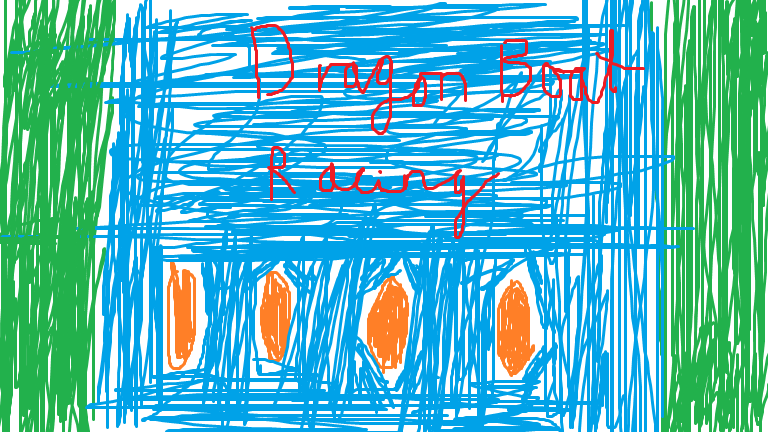

# Week 5

In the fifth week, the first prototype of the game was ready. We now needed to focus on the documentation aspect of the project, which included the systematic justification, a first draft of the risk assessment and more work on method selection and planning.  
This is where the agile “SCRUM” approach came in handy, as we were modifying some information based on what we learned since we first drafted it.  
Meanwhile, the development of the game continued with adding new features and merging core aspects of the game with UI elements.

## Meeting 7 (03/11/2020)

- Checked out some documentation
- Shared some music with the team to gather thought on including it in the game

### Attendance

Dragos, Rhys, Quentin, Sam

## Meeting 8 (05/11/2020)

- Planned out next week
- Worked out what we still need to do
- Contacted lecturers about missing team member

### Attendance

Rhys, Sam, Quentin, Dragos
