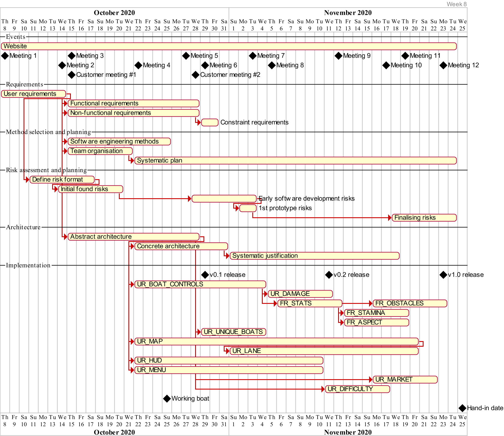

# Week 8

We Finalising on the documents, going through them to ensure that they are meeting the criteria as much as possible.

We're also attempting to fix as many bugs as possible in the code, so we are doing game tests and trying to use it as a normal user and also trying to push towards the edge cases as well to ensure that the game would be a stable as possible for release.

Furthermore, we also finalised our gantt chart, where we made sure that progress had been tracked correctly.

Also, we had finished the map design, boat design and the sound design making the game look presentable for a final release.

## Meeting 12 (23/11/2020)

- Worked on an issue with the countdown timer
- Went over documentation
- Planned submitting the deliverables

### Attendance

Dragos, Sam, Rhys, Quentin
